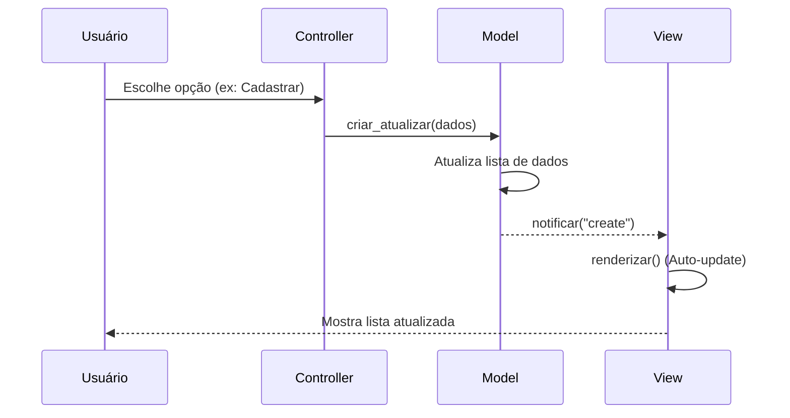

# 📚 MVC Biblioteca

Implementação de um sistema de gerenciamento de biblioteca utilizando a arquitetura **MVC (Model-View-Controller)** em Python.

Este projeto foi desenvolvido com fins educacionais para demonstrar a separação de responsabilidades, o uso de **Design Patterns** e a construção de aplicações modulares sem acoplamento forte entre a interface e os dados.

---

## 🏗️ Arquitetura do Projeto

O projeto segue rigorosamente o padrão MVC, onde cada componente tem uma responsabilidade única:

### 1. Model (O Cérebro)
* **Responsabilidade**: Gerencia os dados (Livros) e a lógica de negócios (Emprestar, Devolver).
* **Padrões Utilizados**:
    * **Singleton**: Garante que exista apenas uma instância do banco de dados em memória (`ModelLivro`).
    * **Subject (Observer Pattern)**: Notifica as Views automaticamente sempre que há uma mudança nos dados (`create`, `update`, `emprestar`, `devolver`).

### 2. View (A Tela)
* **Responsabilidade**: Exibir os dados ao usuário e receber atualizações do Model.
* **Padrão Utilizado**:
    * **Observer**: As Views se "inscrevem" no Model e reagem automaticamente (método `update`) quando os dados mudam, sem que o Controller precise avisar explicitamente para "redesenhar" a tela.

### 3. Controller (O Gerente)
* **Responsabilidade**: Intermediar a interação do usuário. Ele captura o `input` do teclado e decide qual método do Model chamar.

---

## 📂 Estrutura de Arquivos

A organização das pastas reflete a separação de camadas. Baseado no código fonte:

```text
MVC Biblioteca/
│
├── run.py                 # Ponto de entrada (Entry Point) que inicializa o sistema
│
├── controller/
│   └── controller.py      # Lógica de controle e fluxo de menus
│
├── model/
│   ├── ModelLivro.py      # Gerenciador de dados (Singleton)
│   └── Livro.py           # Classe entidade (POJO)
│
└── viwer/                 # Camada de Apresentação
    └── viwer.py           # Classes de visualização (Lista, Detalhes, Disponíveis)

```

---

## 📊 Fluxo de Dados (Diagrama)



---

## ⚙️ Funcionalidades

O sistema roda via terminal e oferece as seguintes opções:

1. **Listar Livros**: Exibe todo o acervo cadastrado.
2. **Listar Disponíveis**: Filtra apenas os livros que não estão emprestados.
3. **Buscar/Detalhes**: Pesquisa por ISBN, Título ou Autor.
4. **Emprestar**: Altera o status do livro para "Indisponível".
5. **Devolver**: Retorna o status do livro para "Disponível".
6. **Cadastrar**: Adiciona novos livros ao acervo em memória.

---

## 🚀 Como Executar

### Pré-requisitos

* Python 3.x instalado.

### Passo a Passo

1. Clone o repositório:
```bash
git clone [https://github.com/MarcoCS2007/MVC.git](https://github.com/MarcoCS2007/MVC.git)

```


2. Acesse a pasta do projeto:
```bash
cd MVC/"MVC Biblioteca"

```


3. Execute o arquivo principal:
```bash
python run.py

```


---

## 🧠 Aprendizados Chave

Este código demonstra conceitos avançados de Orientação a Objetos:

* **Abstração**: Uso da classe abstrata `View(ABC)` para garantir que todas as telas tenham os métodos `renderizar` e `update`.
* **Encapsulamento**: Uso de `@property` e `setters` na classe `Livro`.
* **Gestão de Estado**: O `Controller` gerencia o fluxo (ativar/desativar telas), enquanto o `Model` gerencia o estado dos dados.

---

## ✒️ Autoria e Transparência

Projeto desenvolvido por **[MarcoCS2007](https://github.com/MarcoCS2007)**.

> **Nota sobre o desenvolvimento:**
> Este projeto foi realizado com foco total no aprendizado prático da arquitetura MVC. O código foi estruturado e escrito manualmente pelo autor, evitando o uso de ferramentas de geração de código para garantir a fixação do conteúdo.
>
> * **Uso de IA**: Utilizada apenas para correções pontuais de erros na camada `Controller` e para a geração automática desta documentação (README).

---

